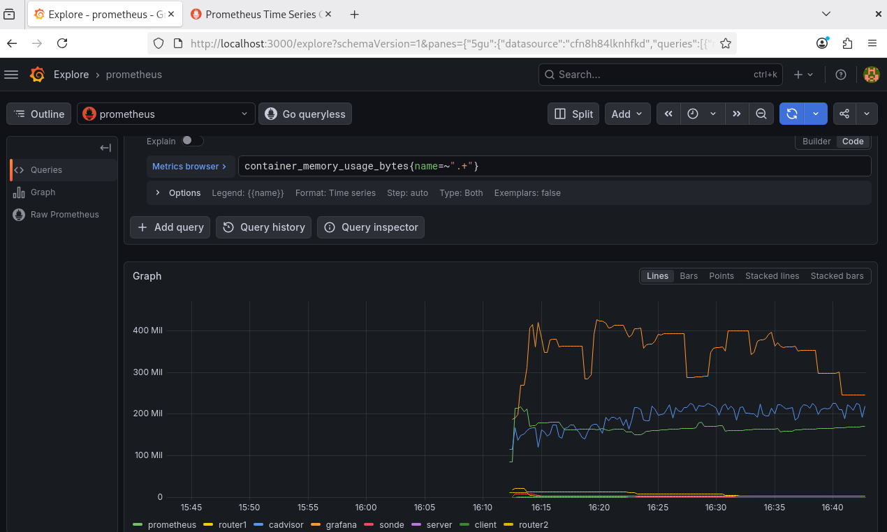

# Topologie 3 (préconfigurée) - Routage Dynamique RIPv2 (OVS + FRR)

## Objectif du lab
Ce scénario déploie une infrastructure réseau avancée de niveau 3 dite "pur SDN". L'objectif est de valider le fonctionnement d'un protocole de routage dynamique multi-sauts (RIPv2) au sein d'un environnement strictement conteneurisé.

L'architecture est composée de trois domaines de diffusion distincts portés par Open vSwitch (OVS) :
* **VLAN 10 :** Réseau d'accès du Client (10.1.10.0/24).
* **VLAN 20 :** Réseau d'accès du Serveur (10.1.20.0/24).
* **VLAN 30 :** Réseau de Transit reliant les deux routeurs (10.1.30.0/24).

Pour garantir un comportement réaliste, les nœuds sont isolés des réseaux Docker natifs et leurs adresses MAC sont fixées de manière déterministe. Une règle de Port Mirroring (SPAN) est configurée sur le réseau de Transit (VLAN 30) pour observer les échanges de tables de routage (RIP) et le trafic utilisateur.

## Rôles des conteneurs
* **Client & Serveur :** Nœuds d'extrémité pour les tests de connectivité.
* **Router 1 & 2 :** Équipements FRRouting (RIPv2) assurant l'interconnexion des VLANs.
* **Sonde :** Nœud d'observation pour la capture du trafic.

## 1. Observabilité et Monitoring en temps réel
Pour une analyse macroscopique de l'infrastructure, nous avons intégré une stack d'observabilité complète : **cAdvisor**, **Prometheus** et **Grafana**.
* **cAdvisor** : collecte les métriques système (CPU, RAM, Réseau) de chaque conteneur.
* **Prometheus** : stocke ces métriques dans une base de données temporelle.
* **Grafana** : interface visuelle permettant de corréler la charge système avec le trafic réseau.

### Validation du monitoring
La figure ci-dessous illustre la remontée effective des données de consommation mémoire de l'ensemble des conteneurs du lab :


*Figure 1 : Visualisation multi-séries de la consommation mémoire par conteneur.*

Pour visualiser ces métriques, accédez à `http://localhost:3000` et utilisez la requête PromQL suivante dans l'onglet **Explore** :
```promql
container_memory_usage_bytes{name=~".+"}
```

## 2. Exécution du déploiement automatisé
Le script `setup_solution3Lab.sh` gère l'intégralité du cycle de vie : nettoyage, isolation SDN, câblage OVS, et configuration de RIPv2.

Lancez l'infrastructure avec :
```bash
chmod +x setup_solution3Lab.sh
./setup_solution3Lab.sh
```

## 3. Visualisation du trafic capturé
Le test génère un fichier `.pcap` sur la machine hôte : `/home/debian/PRES/captures_trafic/trafic_topo3/capture_topology3_rip.pcap`.

* **Analyse :** Ouvrez ce fichier avec Wireshark et filtrez par `rip` pour observer les mises à jour de routage, ou `icmp` pour vérifier la connectivité entre le Client et le Serveur.

## 4. Expérimentation et vérification
* **Convergence RIP :** Vérifiez les tables de routage via `docker exec router1 ip route`.
* **Traçage :** Utilisez `traceroute -n 10.1.20.2` depuis le client pour confirmer le cheminement via le VLAN 30.

## Conclusion
Ce projet démontre la maîtrise d'une architecture SDN résiliente et instrumentée. L'intégration de la stack d'observabilité permet non seulement de valider la connectivité réseau, mais également d'analyser la performance système de chaque entité de la topologie. Cette approche "Full-Stack" garantit une visibilité totale sur le comportement dynamique des protocoles de routage dans un environnement conteneurisé.
